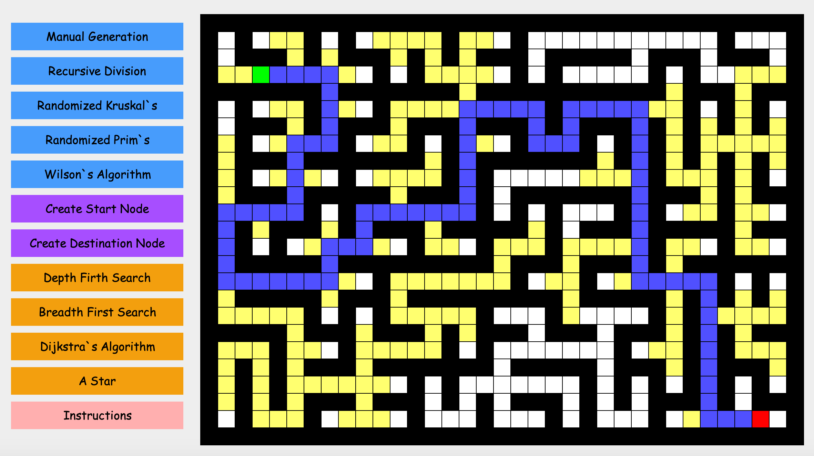

# Maze_Visualizer
Created a maze visualization with advanced algorithms to generate a maze and path find between two points.

Algorithms Included:

      Recursive Division
      Randomized Kruskal's Algorithm
      Randomized Prim's Algorithm
      Wilson's Algorithm
      Depth First Search
      Breadth First Search
      Dijkstra's Algorithm
      A Star Pathfinding

1) Select a Blue Maze Generation Algorithm to Generate a Random Maze.

        - Manual Generation is Controlled By Mouse Click.
        - Left Click on the Maze to Create Walls, and Right Click to Delete Walls.
2) Create Start and Destination Nodes By Selecting Purple Buttons.

        - Left Click to Add Start or Destination to Maze.
        - Right Click on Start or Destination to Delete From Maze.
3) Select an Orange Pathfinding Algorithm.

        - Algorithm will Pathfind Between the Start and Destination Node.
**Green** is your start node

**Red** is your destination node

**Yellow** is the search area

**Blue** is the path

