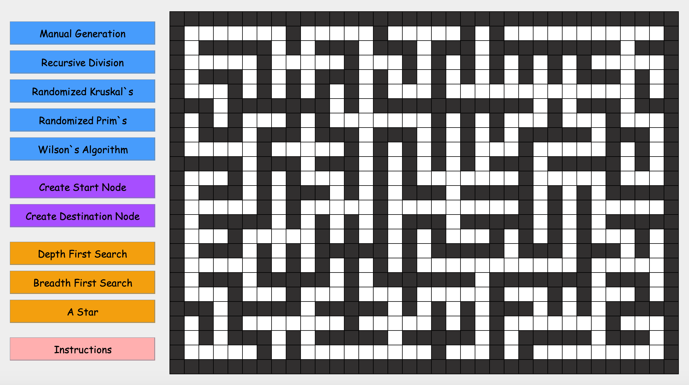
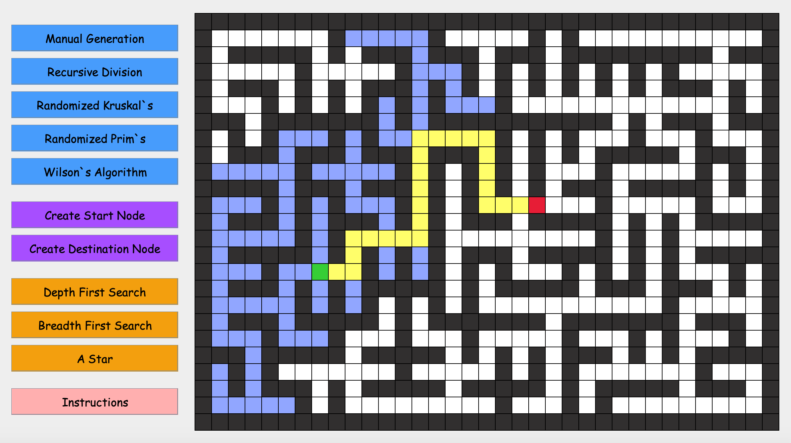

# Maze_Visualizer
A maze visualization using Java with advanced algorithms to generate a maze and path find between two points.

## Maze Generation Algorithms:

Recursive Division

        - Recursively divide the maze into smaller segments with randomly positioned walls to 
          create a fraction-like maze.

Randomized Kruskal's Algorithm
        
        - Generates a perfect maze by creating a minimum spanning tree from a set of all
          posible connections in maze.

Randomized Prim's Algorithm
        
        - Algorithm generates random passages with short dead ends that create a minimum 
          spanning tree. 

Wilson's Algorithm

        - Creates a maze by performing a series of loop-erased random walks to join different 
          passages together.

## Pathfinding Algorithms:

Depth First Search

        - Traverses maze as far as possible along each passage before backtracking.
        
Breadth First Search

        - Explores positions in maze at current depth level from start position, before moving
          on to positions at next depth level.
        
A Star Pathfinding        
        
        - Calculates cost of each move using heuristics to find shortest path in optimal time.

## Instructions:

1) Select a Blue Maze Generation Algorithm to Generate a Random Maze.

        - Manual Generation is Controlled By Mouse Click.
        - Left Click on the Maze to Create Walls, and Right Click to Delete Walls.
2) Create Start and Destination Nodes By Selecting Purple Buttons.

        - Left Click to Add Start or Destination to Maze.
        - Right Click on Start or Destination to Delete From Maze.
3) Select an Orange Pathfinding Algorithm.

        - Algorithm will Pathfind Between the Start and Destination Node.

## Maze Colours:
**Green** is your start node

**Red** is your destination node

**Yellow** is the search area

**Blue** is the path

## Random Maze Generated With Randomized Kruskal's Algorithm:

## Path Found Using Breadth First Search:

